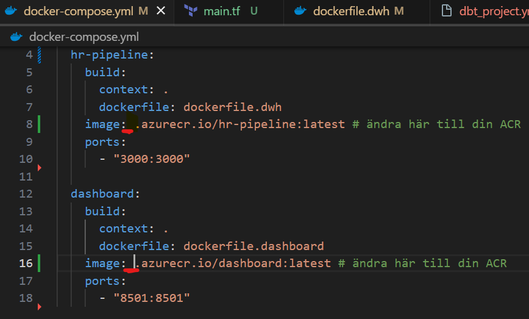
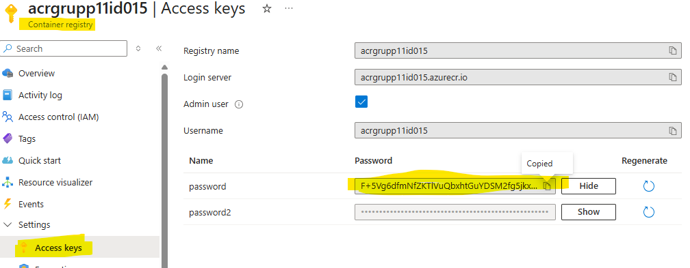
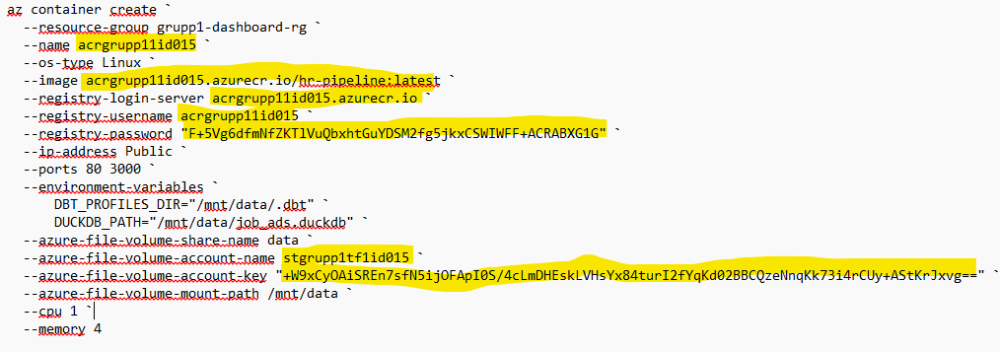

# HR Analytics – Cloud Deployment  

This project builds upon our earlier project <a href="https://github.com/AlejandroHiroshima/Data_warehouse_grupp4_DE24" target="_blank" rel="noopener noreferrer">
  HR Analytics Proof of Concept ↗
</a>, which implemented a modern data stack for analyzing job advertisements from Arbetsförmedlingen JobTech API. 
The previous version used DLT for ingestion, DBT for data transformation, and Streamlit for dashboard visualization within a local environment and Snowflake-based data warehouse.
In this continuation, the solution is extended to a cloud-based deployment on Microsoft Azure, leveraging:
  
- Terraform for Infrastructure as Code (IaC)
- Azure Container Registry (ACR) and App Service for hosting
- Dagster for orchestration
- DuckDB as the analytical data warehouse
  
This version emphasizes scalability, automation and cost efficiency, while transforming the original proof of concept into a production-ready, reproducible cloud pipeline architecture.

---

### Project Architecture ###

| **Layer**              | **Technology / Tools**    | **Purpose**                            |
| ---------------------- | ------------------------- | -------------------------------------- |
| **Ingestion (EL)**     | DLT, Dagster              | Extracts job ad data from JobTech API  |
| **Transformation (T)** | DBT                       | Cleans, models, and creates data marts |
| **Storage (DW)**       | DuckDB (Azure File Share) | Lightweight data warehouse             |
| **Orchestration**      | Dagster                   | Automates daily ETL jobs               |
| **Visualization**      | Streamlit                 | Dashboard for HR analytics             |
| **Infrastructure**     | Terraform                 | Provisions and manages Azure resources |

---
### Azure Deployment Steps ###

This guide provides step-by-step instructions for deploying the **Big Data Cloud Group 1** application to **Microsoft Azure** using **Terraform**, **Docker**, and **Azure Container Instances (ACI)**.

---

### Prerequisites

Before starting, make sure you have the following installed and configured:

- **Azure CLI** — installed and logged in (`az login`)
- **Terraform** — installed and available in PATH
- **Docker Desktop** — installed and running
- **An active Azure subscription**

---

#### Step 1: Provision Infrastructure with Terraform

##### 1.1 Navigate to the Terraform folder

Open a terminal (PowerShell or CMD) and go to your Terraform project directory:

```powershell
cd C:\Users\alexa\Documents\big_data_cloud_group1\IaC_terraform

```
##### 1.2 Initialize Terraform

terraform init

##### 1.3 Plan the infrastructure

Replace `<your subscription ID>` and `<your name>` with your actual values:

```powershell
terraform plan -var="subscription_id=<your subscription ID>" -var="owner=<your name>"
```

##### 1.4 Apply the infrastructure

```powershell
terraform apply -auto-approve -var="subscription_id=<your subscription ID>" -var="owner=<your name>"
```

###### Terraform will automatically create:
* A Resource Group
* A Storage Account + File Share
* A Container Registry (ACR)
* A Container Instance (Dagster)
* An App Service + Service Plan

#### Step 2: Update docker-compose.yml with Your ACR Name

##### 2.1 Find your ACR name
In the Azure Portal:
##### Resource Groups → grupp1-dashboard-rg → Container Registry
Copy your ACR name (for example: `acrgrupp1abc123`).

##### 2.2 Edit `docker-compose.yml`
Open the file in your project root and insert your ACR name between `image:` and `.azurecr.io/`.

##### Before:

```yaml
image: .azurecr.io/hr-pipeline:latest
```

##### After: 

```yaml
image: acrgrupp1abc123.azurecr.io/hr-pipeline:latest
```


#### Step 3: Build Docker Images

Navigate to the project root and build all Docker images:


```powershell
cd C:\Users\alexa\Documents\big_data_cloud_group1
docker compose build
```

#### Step 4: Log in to Azure Container Registry (ACR)

##### 4.1 Retrieve ACR credentials
In the Azure Portal:
###### Container Registry → Access keys (under Settings)



Copy:
- **Username:** same as your ACR name
- **Password:** use either password or password2

##### 4.2 Log in with Docker

```powershell
docker login <your acr name>.azurecr.io
```
#### Step 5: Push Docker Images to ACR

Push both images to your ACR:

```powershell
docker push <your acr name>.azurecr.io/hr-pipeline:latest
docker push <your acr name>.azurecr.io/dashboard:latest
```

#### Step 6: Create an Azure Container Instance for Dagster

##### 6.1 Open Azure Cloud Shell

In the Azure Portal, click the Cloud Shell icon (PowerShell) in the top navigation bar.

##### 6.2 Run the following command
Replace all placeholders (`<...>`) with your actual values:




```powershell
az container create `
  --resource-group grupp1-dashboard-rg `
  --name <your acr name> `
  --os-type Linux `
  --image <your acr name>.azurecr.io/hr-pipeline:latest `
  --registry-login-server <your acr name>.azurecr.io `
  --registry-username <your acr name> `
  --registry-password "<your acr password>" `
  --ip-address Public `
  --ports 80 3000 `
  --environment-variables `
      DBT_PROFILES_DIR="/mnt/data/.dbt" `
      DUCKDB_PATH="/mnt/data/job_ads.duckdb" `
  --azure-file-volume-share-name files `
  --azure-file-volume-account-name <your storage account name> `
  --azure-file-volume-account-key "<your storage account access key>" `
  --azure-file-volume-mount-path /mnt/data `
  --cpu 1 `
  --memory 4
```

#### Step 7: Run the Dagster Pipeline

##### 7.1 Find the Container Instance URL
In the Azure Portal:
##### Resource Groups → grupp1-dashboard-rg → Container Instances → [your container]
Copy the IP address and open it in your browser (append :`3000`):

```cpp
http://<container-ip>:3000
```
##### 7.2 Materialize data in Dagster UI
Open the Dagster UI
Click "***Materialize All***" to trigger a full pipeline run
Wait until all jobs complete successfully
##### 7.3 Verify the DuckDB file
Go to:
##### Azure Portal → Storage Account → File Shares → files
You should now see a file named `job_ads.duckdb`.


#### Step 8: Access the Streamlit Dashboard

##### 8.1 Find your App Service URL
In the Azure Portal:
##### Resource Groups → grupp1-dashboard-rg → App Service
Click the URL (for example):

```arduono 
https://grupp1-dashboard-appxyz.azurewebsites.net
```

Your Streamlit dashboard should now be live.

### Troubleshooting
##### Container Instance fails to start
- Check that the ACR password and Storage Account key are correct
- Review logs in Azure Portal → Container Instance → Logs
##### Dashboard shows no data
- Ensure the Dagster pipeline has completed successfully
- Verify that `job_ads.duckdb` exists in the File Share
- Restart your App Service
##### Docker push fails
- Verify login:

```powershell
docker login <your acr name>.azurecr.io
```
- Check that the image names in `docker-compose.yml` match your ACR name

### Clean Up Resources
To remove all Azure resources and avoid unnecessary costs:

```powershell
cd C:\Users\alexa\Documents\big_data_cloud_group1\IaC_terraform
terraform destroy -var="subscription_id=<your subscription ID>" -var="owner=<your name>"
```
---
                                                                            
### Cost Estimation 

Cost estimation are based on following assumptions: 

•	The DuckDB data warehouse is updated once per day as part of the scheduled ETL workflow.

•	The deployed Streamlit dashboard remains continuously available to users for real-time access and monitoring.

#### Azure + DuckDB cost estimation ### 

| **Type**                | **Estimated Monthly Cost (USD)** | **Description**                                     |
| ---------------------------- | -------------------------- | --------------------------------------------- |
| **App Service (P0v3)**           | ≈ 64.97 $                |Hosts the Streamlit dashboard (24/7)                  |
| **Container Registry (Basic B1)**   | ≈ 6 $                | Stores Docker images for pipeline & dashboard |
| **Storage account - Azure File Share (10 GB)**     | ≈ 0.27 $                   | Stores DuckDB database & DBT profiles                     |
| **Container Instance (Dagster)** | ≈ 1.01 $                    | Runs ETL job once per day (~30 min) daily 
| **Total / Month**            | **≈ 72.25 $**            |                |

<sub>**Note:** The Dagster container is executed once per day (~30 minutes runtime), while the App Service runs continuously to keep the dashboard available 24/7.</sub>

#### Azure + Snowflake cost estimation

| Resource                          | Estimated Monthly Cost (USD) | Description                                 |
| --------------------------------- | ---------------------------- | ------------------------------------------- |
| **App Service (P0v3)**            | ≈ 64.97 $                     | Hosts Streamlit dashboard (24/7)        |
| **Container Registry (Basic B1)** | ≈ 6 $                    | Stores Docker images               |
| **Container Instance (Dagster)**  | ≈ 1.01 $                     | Executes ETL orchestration once per day    |
| **Snowflake Warehouse (X-Small)** | ≈ 15 $                    | Compute engine (1 credit/h × 7,5 h × $2). Runs 15 min daily    |
| **Snowflake Storage (~10 GB)**    | ≈ 0.40 $                      | Cloud storage for raw & transformed tables |
| **Azure File Share**              | —                            | Replaced by Snowflake storage.              |
| **Total / Month**                 | **≈ 87.38 $**                |
### Pros and Cons 

| Aspect                         | **Azure + DuckDB**                       | **Azure + Snowflake**                        |
| ------------------------------ | ---------------------------------------- | -------------------------------------------- |
| **Cost**                       | ✅ Low (~72 $  /mo)                     | ❌ Higher (~ 87 $/mo) due to compute billing   |
| **Performance**                | ⚠️ Limited to single process (embedded)  | ✅ High performance with scalable compute     |
| **Concurrency**                | ⚠️ One user/process at a time for writes | ✅ Supports many concurrent queries           |
| **Management**                 | ✅ Simple (no server admin)               | ✅ Fully managed but requires tuning costs    |
| **Scalability**                | ⚠️ Constrained by VM and file size       | ✅ Elastic compute & storage scale separately |
| **Data sharing / integration** | ❌ Hard to share data externally          | ✅ Built-in data sharing & governance         |
| **Latency**                    | ✅ Low (local read access)                | ⚠️ Network latency to Snowflake region        |
| **Use case fit**               | Small team analytics / PoC / low cost    | Enterprise or multi-user production          |

---

### Project Structure Overview

``` 
BIG_DATA_CLOUD_GROUP1/
│
├── dagster_home/                    
│
├── dashboard/                       
│   ├── connect_duck_pond.py           
│   ├── dashboard.py                  
│   └── plots.py                    
│
├── data_extract_load/                
│   ├── __pycache__/                   
│   └── load_job_ads.py               
│
├── data_transformation/              
│   ├── dbt_packages/                 
│   ├── logs/                         
│   ├── macros/                       
│   ├── models/                       
│   │   ├── dim/                      
│   │   ├── fct/                      
│   │   └── mart/                     
│   ├── src/                          
│   ├── target/                      
│   ├── dbt_project.yml              
│   ├── package-lock.yml             
│   └── packages.yml                 
│
├── duck_pond/                       
│   ├── .gitkeep                     
│   └── job_ads.duckdb               
│
├── files/                           
│
├── IaC_terraform/                   
│   ├── .terraform/                  
│   ├── .gitignore                   
│   ├── .terraform.lock.hcl          
│   ├── main.tf                      
│   ├── profiles.yml                 
│   ├── terraform.tfstate            
│   └── terraform.tfstate.backup     
│
├── logs/                            
│
├── orchestration/                   
│   ├── __pycache__/                 
│   ├── logs/                        
│   └── definitions.py               
│
├── docker-compose.yml               
├── dockerfile.dashboard            
├── dockerfile.dwh                  
│
├── README.md                       
├── requirements.txt                
└── requirements_mac.txt            


```

###### Thanks for checking out our project!
Best regards,
Alex, Erik & Eyoub