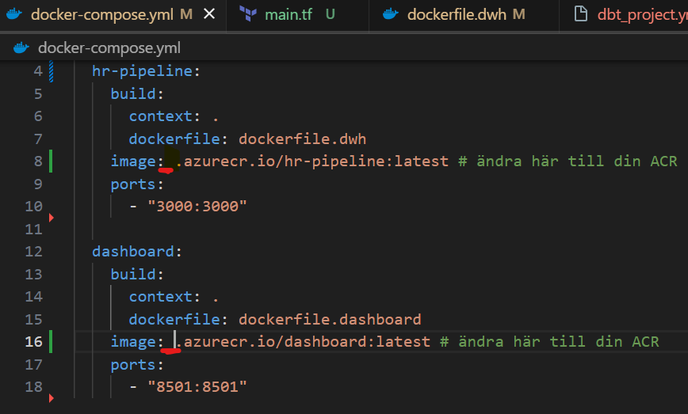
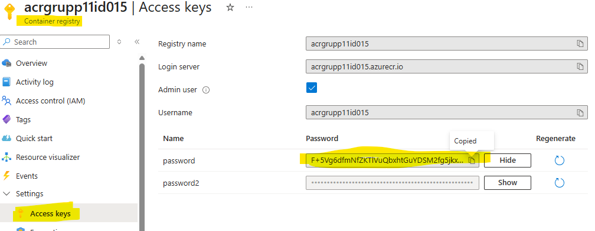
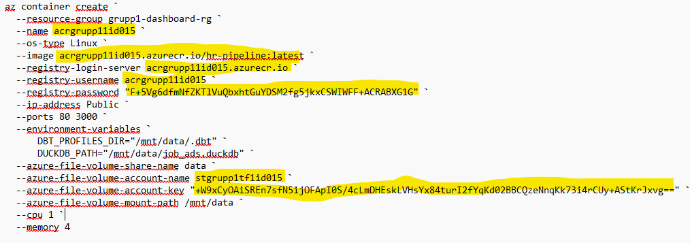
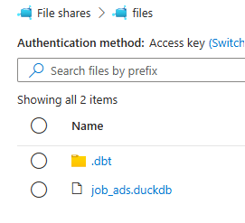

# Big Data Cloud Group 1 - Deployment Guide

Detta är en steg-för-steg guide för att deploya vår Big Data-applikation till Azure med Terraform, Docker och Azure Container Instances.

---

## Förutsättningar

- Azure CLI installerat och inloggat (`az login`)
- Terraform installerat
- Docker Desktop installerat och igång
- Ett Azure-konto med en aktiv subscription

---

## Steg 1: Provisionera infrastruktur med Terraform

### 1.1 Navigera till Terraform-mappen

Öppna en terminal (PowerShell eller CMD) och navigera till projektroten:

```powershell
cd C:\Users\alexa\Documents\big_data_cloud_group1\IaC_terraform
```
### 1.2 Initiera Terraform
```powershell
 terraform init
 ```

### 1.3 Planera infrastrukturen
Ersätt <ditt subscription ID> med ditt Azure Subscription ID och <ditt namn> med ditt namn:

```powershell
terraform plan -var="subscription_id=<ditt subscription ID>" -var="owner=<ditt namn>"
```

### 1.4 Applicera infrastrukturen
```powershell
terraform apply -auto-approve -var="subscription_id=<ditt subscription ID>" -var="owner=<ditt namn>"
```

## Steg 2: Uppdatera docker-compose.yml med ditt ACR-namn
### 2.1 Hitta ditt ACR-namn
Gå till Azure Portal → Resource Groups → grupp1-dashboard-rg → Container Registry.

Kopiera namnet på din ACR (t.ex. acrgrupp1abc123).

## 2.2 Redigera docker-compose.yml
Öppna filen docker-compose.yml i projektroten och sätt in ditt ACR-namn mellan image: och .azurecr.io/ på rad 8 och rad 16.

Exempel:

Före:
```powershell
image: .azurecr.io/hr-pipeline:latest
```

Efter:
```powershell
image: acrgrupp1abc123.azurecr.io/hr-pipeline:latest
```


## Steg 3: Bygg Docker-images
Navigera till projektets root-mapp (där docker-compose.yml ligger) och bygg alla images:
```powershell
cd C:\Users\alexa\Documents\big_data_cloud_group1
docker compose build
```

## Steg 4: Logga in på Azure Container Registry

### 4.1 Hämta ACR-inloggningsuppgifter
Gå till Azure Portal → din Container Registry → Access keys (under Settings).


Kopiera:

Username (samma som ACR-namnet)
password (använd antingen password eller password2)

### 4.2 Logga in med Docker
Ersätt "ditt acr namn" med ditt ACR-namn:
```powershell
docker login <ditt acr namn>.azurecr.io
```
Ange username och password när du blir ombedd.

## Steg 5: Pusha Docker-images till ACR
Ersätt "ditt acr namn" med ditt ACR-namn:
```powershell
docker push <ditt acr namn>.azurecr.io/hr-pipeline:latest
docker push <ditt acr namn>.azurecr.io/dashboard:latest
```

## Steg 6: Skapa Azure Container Instance för hr-pipeline

### 6.1 Öppna Azure Cloud Shell
Gå till Azure Portal och klicka på Cloud Shell-ikonen (PowerShell) längst upp till höger.

### 6.2 Kör följande kommando
⚠️ Viktigt: Byt ut följande värden mot dina egna (se markerade fält i bild 3):

--name → ditt ACR-namn (t.ex. acrgrupp1abc123)
--image → "ditt acr namn".azurecr.io/hr-pipeline:latest
--registry-login-server → "ditt acr namn".azurecr.io
--registry-username → ditt ACR-namn
--registry-password → ditt ACR-lösenord (från Access Keys)
--azure-file-volume-account-name → ditt Storage Account-namn (hittas i portalen under Resource Group)
--azure-file-volume-account-key → din Storage Account Access Key (hittas under Storage Account → Access keys)



```powershell
az container create `
  --resource-group grupp1-dashboard-rg `
  --name <ditt acr namn> `
  --os-type Linux `
  --image <ditt acr namn>.azurecr.io/hr-pipeline:latest `
  --registry-login-server <ditt acr namn>.azurecr.io `
  --registry-username <ditt acr namn> `
  --registry-password "<ditt acr lösenord>" `
  --ip-address Public `
  --ports 80 3000 `
  --environment-variables `
      DBT_PROFILES_DIR="/mnt/data/.dbt" `
      DUCKDB_PATH="/mnt/data/job_ads.duckdb" `
  --azure-file-volume-share-name files `
  --azure-file-volume-account-name <ditt storage account namn> `
  --azure-file-volume-account-key "<din storage account access key>" `
  --azure-file-volume-mount-path /mnt/data `
  --cpu 1 `
  --memory 4
  ```

## Steg 7: Kör Dagster-pipeline
## 7.1 Hitta Container Instance URL
Gå till Azure Portal → Resource Groups → grupp1-dashboard-rg → Container Instances → klicka på din container.

Kopiera IP-adressen och lägg till :3000 på slutet i webbläsaren:

http://<container-ip>:3000
## 7.2 Materialisera data i Dagster UI
I Dagster UI:

Klicka på "Materialize all" för att köra hela pipelinen.
Vänta tills alla jobb är klara.
## 7.3 Verifiera att DuckDB-filen skapades
Gå till Azure Portal → Storage Account → File shares → files.

Du ska nu se filen job_ads.duckdb i mappen.


## Steg 8: Öppna Dashboard (Streamlit App)
### 8.1 Hitta App Service URL
Gå till Azure Portal → Resource Groups → grupp1-dashboard-rg → App Service.

Klicka på URL:en (t.ex. https://grupp1-dashboard-appxyz.azurewebsites.net).

Din Streamlit-dashboard ska nu vara live! 🎉

## Felsökning
### Problem: Container Instance startar inte
Kontrollera att ACR-lösenordet och Storage Account-nyckeln är korrekta.
Kolla loggar i Azure Portal under Container Instance → Logs.
### Problem: Dashboard visar ingen data
Se till att Dagster-pipelinen har körts klart och att job_ads.duckdb finns i File Share.
Restart App Service via Azure Portal.
### Problem: Docker push misslyckas
Kontrollera att du är inloggad på rätt ACR: docker login <ditt acr namn>.azurecr.io
Verifiera att image-namnen i docker-compose.yml matchar ditt ACR-namn.
## Rensa resurser (när du är klar)
För att ta bort alla Azure-resurser och undvika kostnader:
```powershell
cd C:\Users\alexa\Documents\big_data_cloud_group1\IaC_terraform
terraform destroy -var="subscription_id=<ditt subscription ID>" -var="owner=<ditt namn>"
```

## Tack för oss!
### Hälsningar från Alex, Erik & Eyoub